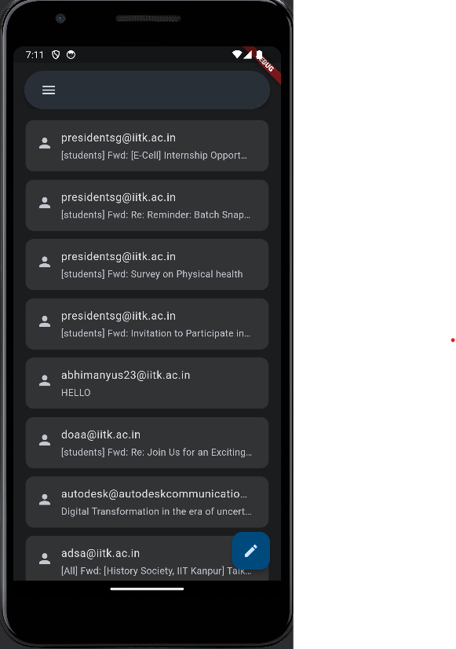

# Mail Client


## Getting Started

Clone the repo 

```bash
git clone https://github.com/Abhimanyu-dev/MailClient.git
```

Change into the directory

```bash 
cd MailClient
```

Install dependencies
```bash
flutter pub get
```
If you are using vscode open the directory in vscode and select the device in the bottom right corner and press F5 the app should run in the chosen device(Preferably in an android emulator or actual android device using USB tethering).


### Features
The app uses flutter hive package to store the last logged in user and the mails from that user. Hive storage only stores the user's username and password along with mails that have been loaded. The stored mails only include the mail addresss of the sender, the subject of the mail and the sequence id of the mail to fetch the mail from the imap server when needed. In order to prevent making a large number of network calls the app loads mails as the user scrolls and then stores them in local storage.
<br>
The user can view mails present in their inbox, send mails and keep their credentials stored in the phone's storage.

### Screenshots

* Landing Page


* Sign In Page


* Home Page


* Mail Page


* Sending Page


